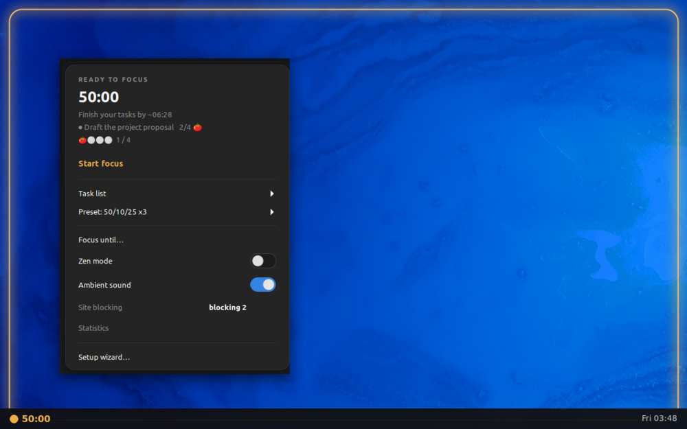
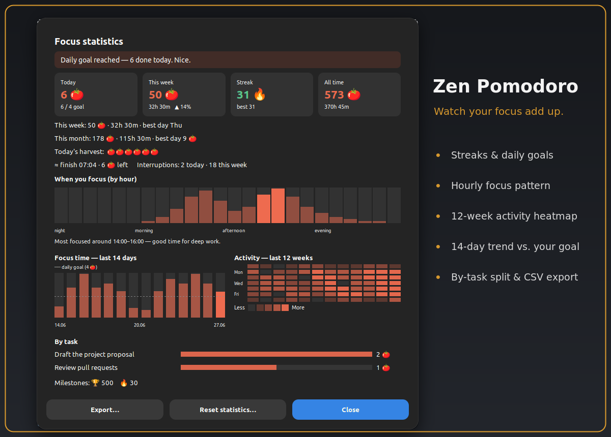

<p align="center">
  
</p>

<h1 align="center">Zen Pomodoro</h1>

<p align="center">
  <strong>A calm, Zen-style Pomodoro timer for the Cinnamon panel.</strong>
</p>

<p align="center">
  <a href="https://github.com/vtestah/zen-pomodoro/actions/workflows/tests.yml"></a>
  <a href="https://github.com/vtestah/zen-pomodoro/releases"></a>
  <a href="LICENSE"></a>
</p>

<p align="center">
  
</p>

<p align="center">
  
</p>

It gives you gentle on-screen cues instead of anxious alarms: a soft glow frame
that traces your progress, a quiet start ritual, a calm ending, an optional
full-screen Zen mode, and a breathing guide on breaks.

## Why Zen Pomodoro?

Most Pomodoro timers interrupt you: a jarring alarm, a popup that demands a
click, a countdown that quietly piles on pressure. Zen Pomodoro takes the
opposite approach. Your progress shows as a soft glow at the edge of the screen,
focus ends calmly instead of blinking at you, and if a block runs out while
you're mid-thought, **soft landing** waits for a natural pause instead of cutting
you off. It stays out of your way, works with a screen reader, and speaks 20
languages.

This repository is the **single source of truth**, and the code in `6.4/` is the
public applet exactly as published. There is no personal/public split. Optional
**site blocking** (edits a clearly-marked section of `/etc/hosts` via a
polkit/pkexec prompt) and **Pushover** push notifications (you supply your own
keys) are regular, off-by-default features. `build-public.sh` simply packages
this source for Cinnamon Spices (see
[Publishing to Cinnamon Spices](#publishing-to-cinnamon-spices)).

Originally based on **Pomodoro Timer** by *gfreeau* (GPLv3); since substantially rewritten.

## Install

**From Cinnamon (once published on Spices):** right-click the panel → *Applets*
→ *Download* tab → search **"Zen Pomodoro"** → install, then enable it on the
*Manage* tab.

**Manual install (works today):**
```bash
git clone https://github.com/vtestah/zen-pomodoro.git \
  ~/.local/share/cinnamon/applets/zen-pomodoro@vtestah
```
The folder **must** be named `zen-pomodoro@vtestah` (the applet UUID); Cinnamon
loads the matching version from `6.4/`. Then right-click the panel → *Applets* →
*Manage* and enable **Zen Pomodoro**. To update later, `git pull` in that folder
and reload the applet (or restart Cinnamon with `Ctrl+Alt+Esc`). Requires
Cinnamon 6.x; the applet keeps its data under `~/.local/state/zen-pomodoro/`.

## Features
- **Calm focus cues:** a soft edge-glow frame traces your progress (the panel
  edge stays clear), with a calm ending (no last-minute blinking), a quiet start
  ritual, an optional full-screen Zen spotlight, a breathing guide on breaks, and
  a panel progress ring.
- **Adaptive onboarding:** a short wizard tailors focus length, sounds, breaks
  and blocking from a few questions, with a review step, keyboard and
  screen-reader navigation, and a one-click "Undo last setup".
- **Tasks:** a list with pomodoro estimates and per-task progress, templates, a
  focus-task picker, and quick *Current task* / *Task list* access from the menu.
- **Statistics dashboard:** today, this week, this month, streak and all-time, an
  hourly focus pattern, 14-day bars, a 12-week heatmap, a by-task breakdown,
  milestones, a finish-time estimate, and one-click export to a CSV file.
- **Goals & flow:** a daily goal with a streak and a local celebration,
  flow-extend at the end of a pomodoro, **soft landing** (when a focus block ends
  while you're still working, it waits for a natural pause instead of cutting you
  off), idle auto-pause and resume, and an optional
  **strict focus** mode with no pause or skip mid-block.
- **Calmer breaks:** rotating rest tips with *+5 min* and *Skip break* right in
  the notification, an optional breathing guide, an optional **lock screen on
  breaks** (long breaks only, if you prefer), and **auto-pause and resume of
  music and video** (MPRIS) while you step away.
- **Stay focused:** optional **site blocking** during focus (edits a clearly
  marked block of `/etc/hosts` via a one-time polkit/pkexec authorization),
  **Do-Not-Disturb** while focusing, and a global hotkey to **jot a distracting
  thought** without leaving your flow.
- **Sounds:** a ticking option, phase alerts, an interval chime, and ambient
  soundscapes (white, pink or brown noise, rain, sea, or your own file).
- **Push to your phone (optional):** phase changes via Pushover with your own
  keys, and customizable message text, sound and priority.
- **Automation (optional):** run a command of your choice when focus starts, a
  break starts, or you reach your daily goal.
- **Your look and controls:** theme presets and custom accent colours, frame
  style (glow, border, corners or off), glow intensity, breathing pattern, menu
  font scale and reduce-motion, all with a live preview; drive the timer from the
  panel (scroll to start/pause or change focus length, middle-click to skip,
  start-on-click) or with keyboard shortcuts.
- **Resilient and accessible:** session recovery after a Cinnamon restart,
  screen-reader summaries for the charts, and **localized into 20 languages**.

## Layout
- `6.4/`: the applet code for Cinnamon 6.x (`applet.js`, `menu.js`,
  `features.js`, `visual.js`, `timer.js`, `sound.js`, `soundfx.js`, `dialogs.js`,
  `constants.js`, `settings-schema.json`, `stylesheet.css`), plus the root-run
  blocking helpers `hosts-helper.py` and `setup-passwordless.py`.
- `po/`: translation sources (`.po`, `.pot`). Compiled `.mo` files go to
  `~/.local/share/locale/...` and are **not** committed.
- `metadata.json`: the single source of truth for the version.
- `build-public.sh`: packages this source into the Spices layout under `dist/`.
- `release.sh`, `cliff.toml`, `CHANGELOG.md`, `RELEASING.md`: release tooling.
- `.githooks/commit-msg`: Conventional Commits check.
- `*.svg`, `*.png`, `sounds/`: assets; `screenshot.png` is the Spices store image.

## Development
Edit here. It's the live applet, so reload to test:
```
dbus-send --session --dest=org.Cinnamon /org/Cinnamon \
  org.Cinnamon.ReloadXlet string:'zen-pomodoro@vtestah' string:'APPLET'
```
(or reload from Looking Glass). New translation strings only take effect after a
full Cinnamon restart, since `.mo` files are cached per process.

Commits follow [Conventional Commits], enforced by a dependency-free hook.
Enable it once per clone:
```
git config core.hooksPath .githooks
```

Back up to your own remote:
```
git remote add origin git@github.com:vtestah/zen-pomodoro.git
git push -u origin main
```

## Releasing
`metadata.json` is the only place the version lives. `./release.sh` computes the
next version from your commits (via [git-cliff]), bumps `metadata.json`,
regenerates `CHANGELOG.md`, makes a `chore(release): vX.Y.Z` commit and tag, and
offers to build the public package. Full steps in **[RELEASING.md](RELEASING.md)**.

## Translations
Eight of the 20 catalogs are fully translated (`ru`, `de`, `es`, `fr`, `it`, `nl`, `pt`, `pt_BR`); the rest are partial and fall back to English for untranslated strings. To pick up new strings:
regenerate the `.pot` (`cinnamon-xlet-makepot` run from `6.4/`), `msgmerge` the
`.po` files, fill the gaps, and `msgfmt --check`. `ru` is hand-maintained; the
remaining catalogs are machine translations; native review welcome.

## Publishing to Cinnamon Spices
`./build-public.sh` packages this source into `dist/zen-pomodoro@vtestah/`: it
lays the package out as `UUID/files/UUID/`, writes a clean `metadata.json` (no
`last-edited` / `icon` / `dangerous`), ships only `.po` (no compiled `.mo`), and
includes the blocking helpers. A validator fails the build if a personal path,
`sudo`, a leftover `@PUBLIC_STRIP` marker, or the removed custom-scripts feature
ever reappears.

That export goes into a fork of `linuxmint/cinnamon-spices-applets` as a PR
titled `Zen Pomodoro vX.Y.Z: <summary>` (their convention; PRs are squash-merged).

## Credits & License
Originally based on **Pomodoro Timer** by *gfreeau*, since substantially rewritten. Licensed under the **GPLv3** (see [LICENSE](LICENSE)).

[Conventional Commits]: https://www.conventionalcommits.org
[git-cliff]: https://git-cliff.org
